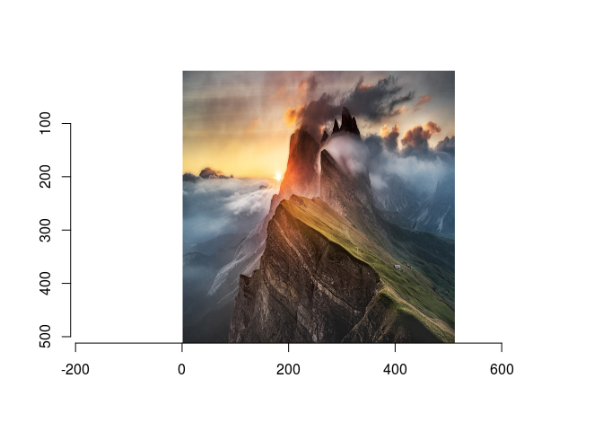

impress: A geotagged dataset of scenic images
================
Philipp Hunziker
July 23, 2018

**impress** is a dataset of 2611 geotagged scenic images collected from the [r/earthporn](http://www.reddit.com/r/earthporn) subreddit, a form where users submit original photographs of scenic landscapes. Each datum consists of a high-resolution image (typically &gt; 1024x1024) together with submission-related data and an estimated geotag.

Data aquisition
---------------

The submission data, including url-links to the submitted images, are collected using an R-based command-line tool that uses the [Python Reddit API Wrapper](https://praw.readthedocs.io/en/latest/), accessed via [reticulate](https://github.com/rstudio/reticulate). The command-line tool listens to the Reddit API via a streaming iterator, and downloads submission information as soon as it is available on Reddit. The submission information (submission title, date, upvotes, etc) is then pushed into a [PostgreSQL database](https://www.postgresql.org/). The latter is to prevent loss-of-data in case of an error, and allows pulling data from Reddit with multiple machines in parallel. Given the submission data, we then download the submission image.

Geparsing
---------

As soon as a submission is streamed from the API, its title is geoparsed, i.e. we make a guess about the location mentioned in the title. This works because the r/earthporn subreddit mandates that submissions need to contain geographic information in the title.

We perform geoparsing using the [geonames](http://www.geonames.org/) location database, a data source containing the names and coordinates of over 9 million gegraphic features (e.g. places, parks, states, countries, etc.). Searching in this database naively (e.g. using grep) would be impractical and time-consuming. For this reason, we set up a local [elasticsearch](https://www.elastic.co/) engine, and use it to index the entire geonames database. We then geoparse titles by posting a [multi-match query](https://www.elastic.co/guide/en/elasticsearch/reference/current/query-dsl-multi-match-query.html) to the search engine.

The data
--------

The dataset currently encompases 2611 entries. Around 1000 of these entries consist of the top-rated submissions to r/earthporn, the rest are submissions collected by streaming the newest submissions since July 18th, 2018. (NOTE: We can't access earlier submissions easily due to the Reddit API's rate limits.)

Here's an extract of the metadata for illustration:

``` r
## Load the data
setwd("~/Projects/incubator/impress")
meta.df <- read.csv('data/meta.csv')
head(meta.df[,c("title", "created_date", "lat", "lon")])
```

    ##                                                                                                                              title
    ## 1                                        Brady's Bluff overlooking a blanketed Mississippi river. Perrot State Park WI [1932x2576]
    ## 2                                                                      Rainbow Falls, Mammoth Lakes, California [OC] [4000 x 6016]
    ## 3 Lake Ingalls thawing out for the summer with Mt. Stuart in the background. Alpine Lakes Wilderness, Washington. (4185x2767) [OC]
    ## 4                                                                Toleak Point, Olympic National Park, Washington. [5895x3929] [OC]
    ## 5                                                                                             La Jolla, San Diego [6016x4016] [OC]
    ## 6                                                                                           Michigan's dark skies (OC) [2345x5432]
    ##          created_date     lat       lon
    ## 1 2018-07-18 12:01:58 44.0177  -91.4657
    ## 2 2018-07-18 12:01:07 37.6047 -119.0110
    ## 3 2018-07-18 11:51:44 47.5651 -121.1600
    ## 4 2018-07-18 11:44:55 47.8340 -124.5420
    ## 5 2018-07-18 11:44:20 43.9367   12.4464
    ## 6 2018-07-18 11:41:40 44.2503  -85.5003

And here's an example submission:

    ## Loading required package: plyr

    ## Loading required package: magrittr

    ## 
    ## Attaching package: 'imager'

    ## The following object is masked from 'package:magrittr':
    ## 
    ##     add

    ## The following object is masked from 'package:plyr':
    ## 
    ##     liply

    ## The following objects are masked from 'package:stats':
    ## 
    ##     convolve, spectrum

    ## The following object is masked from 'package:graphics':
    ## 
    ##     frame

    ## The following object is masked from 'package:base':
    ## 
    ##     save.image


