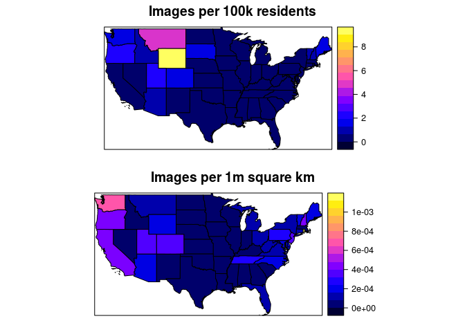

Ranking US states by 'scenicness'
================
Philipp Hunziker
July 23, 2018

Almost half of all submissions to Reddit's [r/earthporn](http://www.reddit.com/r/earthporn) subreddit are photographs of scenic places in the United States. However, as we've seen, these are far from uniformly distributed across the country. In the following, we rank US states by scenicness by counting the number of r/earthporn submissions by state. We can do so thanks to the geoparser we developed to geotag r/earthporn submissions.

Data
----

We start by loading the r/earthporn submission meta data, and the borders of US states as a shapefile (obtained from [here](https://www.census.gov/geo/maps-data/data/cbf/cbf_state.html)). We also fetch state-level population data (from 2015) from the usmap R package.

``` r
library(rgdal)
```

    ## Loading required package: sp

    ## rgdal: version: 1.2-16, (SVN revision 701)
    ##  Geospatial Data Abstraction Library extensions to R successfully loaded
    ##  Loaded GDAL runtime: GDAL 2.2.1, released 2017/06/23
    ##  Path to GDAL shared files: /usr/share/gdal/2.2
    ##  GDAL binary built with GEOS: TRUE 
    ##  Loaded PROJ.4 runtime: Rel. 4.9.2, 08 September 2015, [PJ_VERSION: 492]
    ##  Path to PROJ.4 shared files: (autodetected)
    ##  Linking to sp version: 1.2-3

``` r
library(usmap)
library(sp)

## Load the data
setwd("~/Projects/incubator/impress")
meta.df <- read.csv('data/meta.csv')
states.spdf <- readOGR("geodata/usstates", "cb_2017_us_state_500k")
```

    ## OGR data source with driver: ESRI Shapefile 
    ## Source: "geodata/usstates", layer: "cb_2017_us_state_500k"
    ## with 56 features
    ## It has 9 fields
    ## Integer64 fields read as strings:  ALAND AWATER

``` r
pop.df <- as.data.frame(statepop)
```

Geocode the submissions
-----------------------

Now we geocode the submission data by creating a SpatialPoints object from the lon/lat information we gathered during geo-parsing.

``` r
library(sp)
im.sp <- SpatialPoints(meta.df[,c('lon', 'lat')])
```

Prepare state data
------------------

Next we subset the states in the contiguous united states and join the population data.

``` r
library(rgeos)
```

    ## rgeos version: 0.3-21, (SVN revision 540)
    ##  GEOS runtime version: 3.5.0-CAPI-1.9.0 r4084 
    ##  Linking to sp version: 1.2-3 
    ##  Polygon checking: TRUE

``` r
## Contiguous United States
states.spdf <- states.spdf[!(states.spdf$NAME %in% c("Alaska", "Hawaii", 
                                                     "United States Virgin Islands", 
                                                     "Commonwealth of the Northern Mariana Islands", 
                                                     "American Samoa", 
                                                     "Puerto Rico", "Guam")),]
states.spdf@data <- states.spdf@data[,c("NAME", "STUSPS", "ALAND")]
names(states.spdf) <- c("name", "abbr", "area")
states.spdf$area <- as.numeric(as.character(states.spdf$area))

## Join pop
pop.df <- as.data.frame(statepop)
states.spdf@data <- merge(states.spdf@data, pop.df, by = "abbr", all.x = TRUE, all.y = FALSE, sort = FALSE)
```

Count and normalize images
--------------------------

We then count the number of images per state. Importantly, we also normalize the image counts per capita (100k residents) and per area (1m square km), to avoid falling into the [population density map trap](https://xkcd.com/1138/).

``` r
## Image count per capita and per area
intrs.mat <- gIntersects(states.spdf, im.sp, byid = TRUE)
```

    ## Warning in RGEOSBinPredFunc(spgeom1, spgeom2, byid, func): spgeom1 and
    ## spgeom2 have different proj4 strings

``` r
count <- apply(intrs.mat, 2, sum)
states.spdf$imcount <- count
states.spdf$im_pc <- states.spdf$imcount / (states.spdf$pop_2015/100000)
states.spdf$im_pa <- states.spdf$imcount / (states.spdf$area/1000000)
```

Plot
----

Now let's plot the maps:

``` r
library(sp)

## Plot both
gridExtra::grid.arrange(spplot(states.spdf, zcol = "im_pc", main = "Images per 100k residents"), 
                        spplot(states.spdf, zcol = "im_pa", main = "Images per 1m square km"))
```



In per capita terms, *Wyoming* is the most scenic state! However, tiny *Rhode Island* appears to have the most scenic spots per square kilometer.
