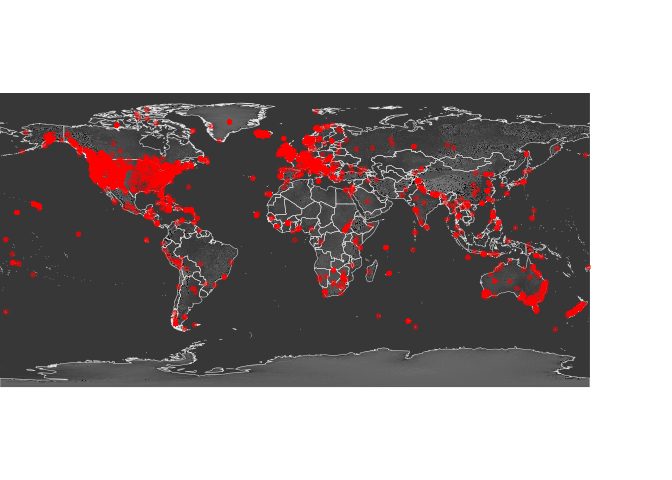
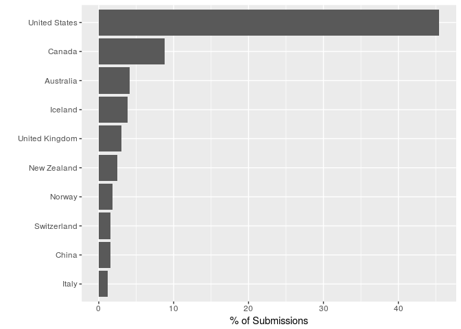

Scenic images around the globe
================
Philipp Hunziker
July 23, 2018

In the following we're going to have a look at the distribution of [r/earthporn](http://www.reddit.com/r/earthporn) submissions around the globe. In particular, we want to go sure that we have at least some images from most corners of the globe, since the end-goal is to recommend *nearby* places to users, which obviously won't work if all images are clustered in a particular area. We're also going to look at the most popular countries for r/earthporn submissions, simply to get an idea of where the most 'scenic' places are.

Data
----

We're going to start by loading the r/earthporn submission meta data, as well as a global relief map and a country border shapefile to generate a pretty plot.

``` r
library(raster)
```

    ## Loading required package: sp

``` r
library(maptools)
```

    ## Checking rgeos availability: TRUE

``` r
## Load the data
setwd("~/Projects/incubator/impress")
meta.df <- read.csv('data/meta.csv')
rs <- raster('geodata/GRAY_HR_SR/GRAY_HR_SR.tif')
data(wrld_simpl)
```

Most popular countries
----------------------

Next, we're going to count r/earthporn submissions to determine the most popular countries in the dataset.

``` r
library(data.table)
```

    ## 
    ## Attaching package: 'data.table'

    ## The following object is masked from 'package:raster':
    ## 
    ##     shift

``` r
meta.dt <- data.table(meta.df)
ccount.dt <- meta.dt[, list(count = length(id)), by = country_name]
ccount.dt <- ccount.dt[order(ccount.dt$count, decreasing = FALSE),]
ccount.dt$prop <- ccount.dt$count/sum(ccount.dt$count)*100
ccount.dt <- tail(ccount.dt, 10)
ccount.df <- as.data.frame(ccount.dt)
ccount.dt$cfactor <- factor(x = ccount.dt$country_name, levels = ccount.dt$country_name)
```

Geocode the submissions
-----------------------

Now we geocode the submission data by creating a SpatialPoints object from the lon/lat information we gathered during geo-parsing.

``` r
library(sp)
im.sp <- SpatialPoints(meta.df[,c('lon', 'lat')])
```

Generating the plot
-------------------

Finally, we can generate the desired plot.

``` r
library(ggplot2)

scale <- 0.075
par(mar = c(0,0,0,0), mai = c(0,0,0,0))
plot(rs, col = grey(seq(0, 0.5, length = 100)), legend=FALSE, axes=FALSE, box=FALSE)
plot(wrld_simpl, add = TRUE, col = NA, border = grey(0.9), lwd = 0.5)
plot(im.sp, add = TRUE, col =  adjustcolor("red", alpha.f = 0.5), pch = 16, cex = 0.8)
```



``` r
p <- ggplot(data=as.data.frame(ccount.dt), aes(x=cfactor, y=prop)) +
  geom_bar(stat="identity") + coord_flip() + ylab("% of Submissions") + xlab("")
print(p)
```



Unsurprisingly, we see a heavy tilt towards the anglophone world - where most Reddit users come from. However, we still observe good coverage across most parts of the globe, especially OECD countries. Hence, in the final application, we should be able to suggest fairly close-by places to most users in the developed world.

One interesting tidbit is how extremely popular Iceland appears to be, despite its tiny size. One contributing factor is certainly the country's stunning natural beauty. However, the data also reflects the recent [tourism boom](https://www.ft.com/content/44ebbfee-025e-11e7-aa5b-6bb07f5c8e12) Iceland has experienced.
